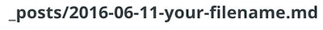

# Static Chat Blog


## How to

Make sure that you are allowed to contribute to the given project before heading over to *prose.io/\[github-username][repository-name]*.


**DIRECTORY**

```
.
├── _data
|   └── about.yml
|       contains the general information about the website like name, social
|       media links or the about section
├── _posts
|   └── contains all chat members in a individual file, as well as the
|       group conversations. Check out the yaml structure below to find out
|       which fields you could enter with some information
└── media
    ├── images
    |   default directory where all chat images are stored
    └── profil_pic
        directory where all profil pictures are stored
```


### Add a new conversation

1. Head over to http://prose.io/#\[github-username]/[repository-name]
2. switch to `_posts`
3.  Use the button in the upper right corner to create a new blogpost
4. Take a look at the section in head of the new site and change `your-filename` of `_posts/2016-06-11-your-filename.md` to your title of the site
   
   *DON'T* change the `_post/` or the actual date `2016-06-11` part
5. If you'd like to show a About section in the Info are of your chat conversation you could now enter the desired text in the area below. Otherwise please delet the placeholder text.
   
6.   Use the marked button to open up the settings section where you could add a all of the needed information for the individual chat view as well as the actual conversation. 

